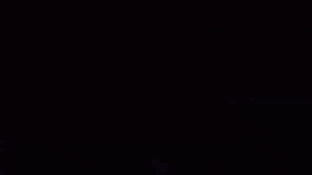
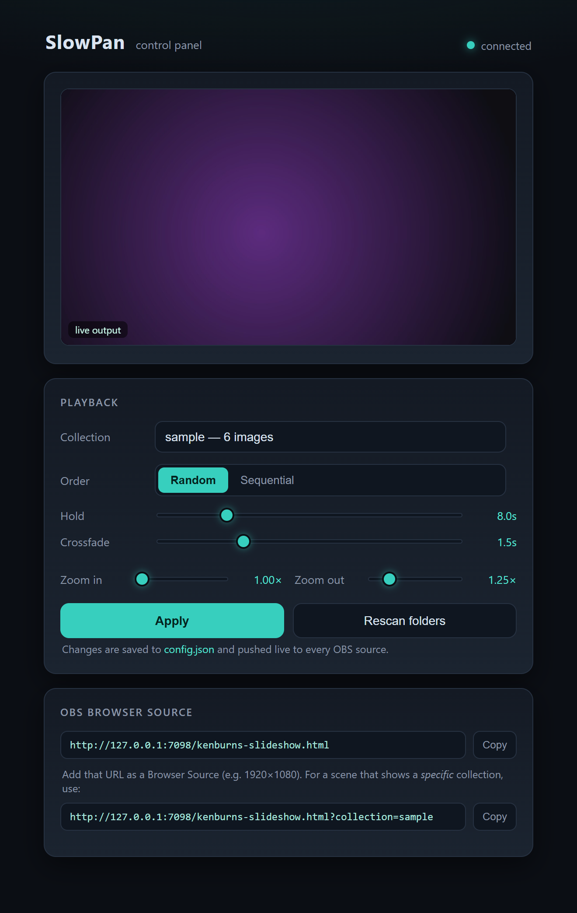

# SlowPan

A theme-agnostic **Ken Burns slideshow** background for OBS, Streamlabs Desktop,
XSplit — any streaming app with a browser source. Point it at a folder of images and it
plays them full-screen with a slow, randomized documentary-style zoom-and-pan plus
crossfades — the effect OBS's built-in Image Slide Show source doesn't do.



- **Bring your own images.** Drop image folders in; nothing is baked in.
- **Two ways to run it** — a tiny bundled server, or inside [Streamer.bot](https://streamer.bot/).
  The overlay is identical; only the data feed differs.
- **Not OBS-specific.** The overlay is a plain local web page (`http://127.0.0.1:…`) —
  it renders in any app whose browser/webpage source is Chromium-based (≥ 80, i.e.
  2020+): OBS and Streamlabs Desktop share the same engine, and current XSplit works
  too (very old XSplit builds shipped an ancient engine — update if the page stays blank).
- **No accounts, no upstream APIs, no telemetry.** Local only.
- MIT licensed. Ships with a handful of CC0 sample backdrops so it works on first run.

> The name is a working title — rename it freely; it appears only in `package.json`,
> this README, and the browser-source URL path.

---

## Option A — bundled server (no Streamer.bot needed)

Requires [Node.js](https://nodejs.org/) 18+.

```
npm install
npm start
```

Then add a **Browser Source** (OBS/Streamlabs; XSplit: *Webpage*) pointing at the URL it prints (default
`http://127.0.0.1:7090/kenburns-slideshow.html`), sized to your canvas (e.g.
1920×1080). That's it — you'll see the bundled `sample` collection panning.

**Tune it live** from the control panel the server also prints —
`http://127.0.0.1:7090/control.html`: pick a collection, adjust hold/crossfade/zoom, and
copy Browser Source URLs. Changes save to `config.json` and push to every OBS source
instantly.



**Windows:** double-click [`start.bat`](start.bat) instead (it installs deps and
copies the config on first run). macOS/Linux: [`start.sh`](start.sh).

### Add your own images

Create a sub-folder under `collections/` and drop images in:

```
collections/
  sample/        <- bundled CC0 backdrops
  my-photos/     <- your folder (jpg / png / webp / gif / avif)
```

Set `"collection": "my-photos"` in `config.json` (see below), or point one source at
it with `?collection=my-photos` on the URL. The server watches the folder — new images
appear live, no restart.

---

## Option B — Streamer.bot

If you already run Streamer.bot, you don't need the bundled server at all. Streamer.bot
hosts the overlay + images and a small C# action supplies the image list. Full steps in
**[docs/STREAMERBOT.md](docs/STREAMERBOT.md)** — in short:

1. Enable SB's **WebSocket Server** (`:8080`) and **HTTP Server** (`:7474`).
2. Map two HTTP paths: `slowpan-media` → your `collections` folder, `slowpan-overlay` →
   the `overlay` folder. (Namespaced so SlowPan coexists with sibling Streamer.bot
   components on the same HTTP server; any prefix works if you keep `MEDIA_BASE` and
   the source URL consistent.)
3. Import [`streamerbot/kenburns-push.cs`](streamerbot/kenburns-push.cs) into an action
   named `Kenburns Push`.
4. Browser Source URL: `http://127.0.0.1:7474/slowpan-overlay/kenburns-slideshow.html?transport=sb`.

---

## Configuration

Copy `config.example.json` to `config.json` (the launchers do this for you) and edit.
Editing `config.json` while the server runs updates overlays live.

| Key | Default | Meaning |
|---|---|---|
| `port` | `7090` | HTTP + WebSocket port |
| `host` | `127.0.0.1` | Bind address |
| `mediaDir` | `./collections` | Folder holding collection sub-folders |
| `collection` | `sample` | Default collection to play |
| `durationMs` | `8000` | Time each image is on screen (excl. crossfade) |
| `transitionMs` | `1500` | Crossfade duration |
| `zoomMin` / `zoomMax` | `1.0` / `1.25` | Ken Burns zoom range |
| `order` | `random` | `random` or `sequential` |

**Per-source override:** add `?collection=<name>` to a Browser Source URL so two scenes
can show different image sets at once.

---

## Images & licensing

The code is MIT (see [LICENSE](LICENSE)). The only runtime dependency is `ws` (MIT);
see [THIRD_PARTY_NOTICES.md](THIRD_PARTY_NOTICES.md).

The bundled `collections/sample/` backdrops were generated procedurally for this
project and are **CC0 / public domain** — use or delete them freely. SlowPan ships with
**no** third-party photos or game art: any images you add are yours, stay local (they're
git-ignored), and are never redistributed by this repo. Please only point it at images
you have the right to use.

## How it works

`docs/PROTOCOL.md` documents the wire format. In brief: the overlay
(`overlay/kenburns-slideshow.html`) is a pure renderer that reacts to a `svc:message`
event carrying `{ config, collections, manifests }`. A transport client feeds it —
`overlay/panel-core.js` (bundled server, same-origin WebSocket) or
`overlay/panel-client-sb.js` (Streamer.bot). Swapping transports is the only difference
between the two run modes.

## Author & support

Built by **Ashe "Flash" Galatine**.

- Email — [AsheJunius@gmail.com](mailto:AsheJunius@gmail.com)
- X — [@AsheJunius](https://x.com/AsheJunius) · BlueSky — [@projectgalatine.com](https://bsky.app/profile/projectgalatine.com)
- Twitch — [FlashGalatine](https://www.twitch.tv/FlashGalatine) · Discord — [Newbie Fight Club](https://discord.gg/NewbieFightClub)

If SlowPan saves you some setup time, support is genuinely appreciated:

- Patreon — [ProjectGalatine](https://www.patreon.com/ProjectGalatine)
- CashApp — [$ProjectGalatine](https://cash.app/$ProjectGalatine)
