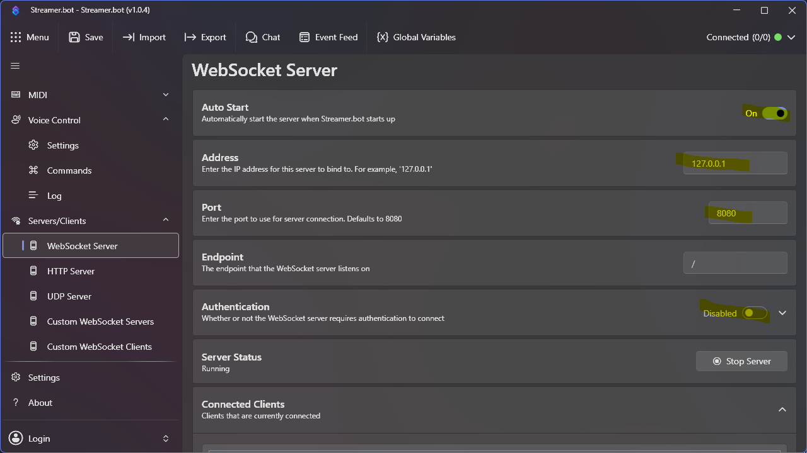
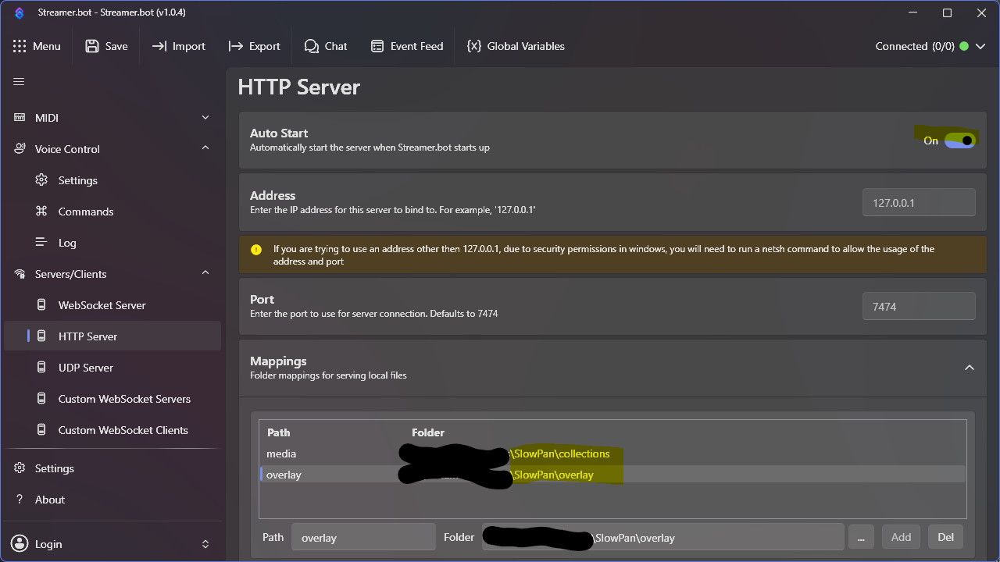
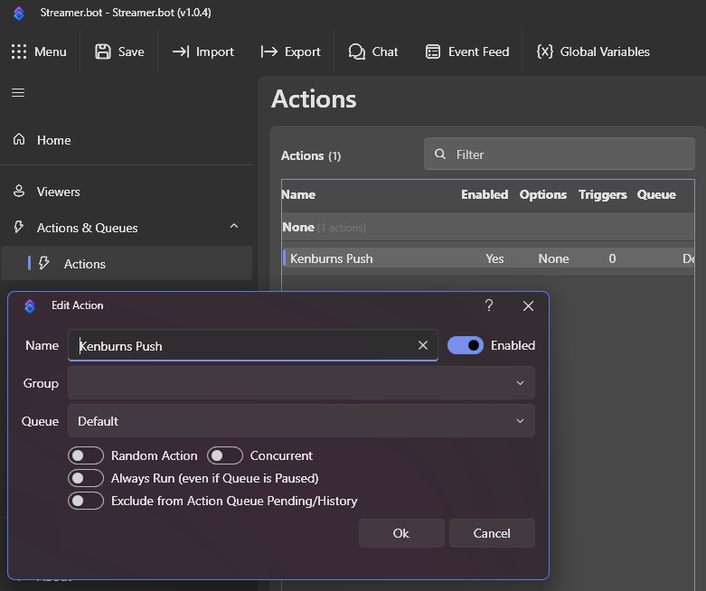
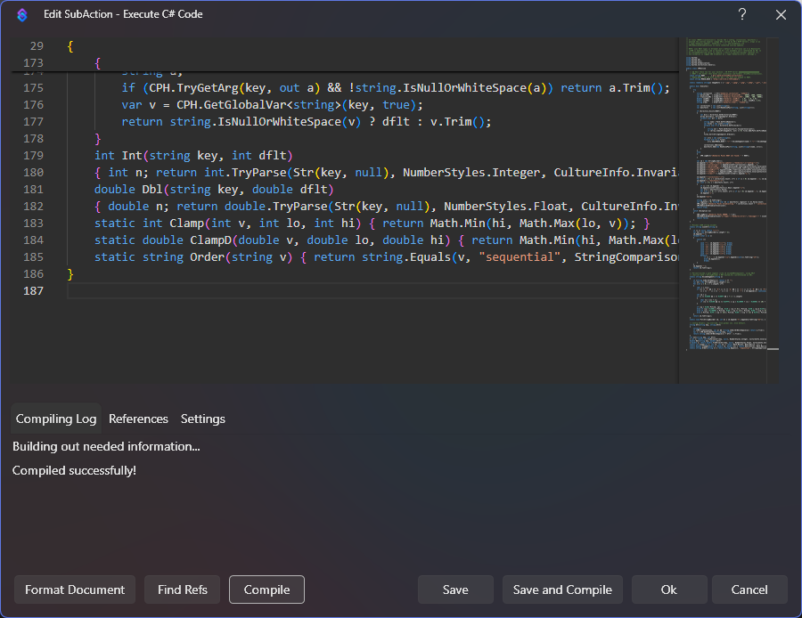

# Running SlowPan inside Streamer.bot

If you already run [Streamer.bot](https://streamer.bot/), you don't need the bundled
Node server — SB hosts the overlay + images and a small C# action supplies the image
list. Verified against Streamer.bot **1.0.4**.

## 1. Enable the two servers

Both live under Streamer.bot → **Servers/Clients**. (Screenshots are from Streamer.bot 1.0.4.)

### WebSocket Server

Enable it and set **Address** `127.0.0.1`, **Port** `8080`, and **Authentication** to
*Disabled* (for local use). Turn **Auto Start** on so it comes up with Streamer.bot.



### HTTP Server

Enable it (default **Port** `7474`), then under **Mappings** add two Path → Folder rows:

| Path | Folder |
|---|---|
| `slowpan-media` | `…\SlowPan\collections` |
| `slowpan-overlay` | `…\SlowPan\overlay` |

`slowpan-media` must match `MEDIA_BASE` in the action; `slowpan-overlay` serves the HTML
and `panel-client-sb.js` (they live in the same folder, so the relative include resolves).

The prefixes are namespaced so SlowPan coexists with sibling Streamer.bot components
sharing the same HTTP server. Any names work — just keep the map, `MEDIA_BASE`, and the
Browser Source URL consistent. Existing installs using the older `media`/`overlay` names
keep working; to migrate, rename both maps, update `MEDIA_BASE` in the action
(re-Compile), and update the OBS source URL together.



## 2. Import the action

Actions → Right Click on Actions list → "Add" named **exactly** `Kenburns Push` (the name matters — the overlay
does `DoAction { name: "Kenburns Push" }` on connect to pull current state).



And then, Right Click on Sub-Actions list → "Add" → **Core → C# → Execute C# Code**, paste [`../streamerbot/kenburns-push.cs`](../streamerbot/kenburns-push.cs),
edit `ROOT` and `MEDIA_BASE` at the top, and **Compile** — it must report success.



Optional persisted global variables override the defaults:
`kenburns.collection`, `kenburns.durationMs`, `kenburns.transitionMs`,
`kenburns.zoomMin`, `kenburns.zoomMax`, `kenburns.order`.

## 3. Add the Browser Source

```
http://127.0.0.1:7474/slowpan-overlay/kenburns-slideshow.html?transport=sb
```

## Switching collections live

Make a second action whose C# sets the variable then re-runs the push:

```csharp
public class CPHInline {
  public bool Execute() {
    string coll;
    if (CPH.TryGetArg("value", out coll) && !string.IsNullOrWhiteSpace(coll))
      CPH.SetGlobalVar("kenburns.collection", coll.Trim(), true);
    CPH.RunAction("Kenburns Push");
    return true;
  }
}
```

## Troubleshooting

Load the overlay in a browser with `?transport=sb&sbdebug=1` and watch the console.

| Last log line | Cause | Fix |
|---|---|---|
| `WebSocket error …` | WS Server off / wrong port / **auth on** | Enable it at `:8080`, auth off |
| `requesting state via DoAction` then nothing | The `Kenburns Push` C# didn't broadcast: name mismatch or a **compile error** | Confirm the action name and that the C# compiled |
| `General.Custom → kenburns:update` but still black | Images 404 | Check the `slowpan-media` Path→Folder map matches `MEDIA_BASE` |

Two Streamer.bot compile gotchas the action already works around: SB's C# host
references **neither `Newtonsoft.Json` nor `System.Uri`** — using either fails to compile
(and the action then runs but broadcasts nothing). This action hand-writes its JSON and
percent-encodes with a built-in helper, so it needs no added references.
